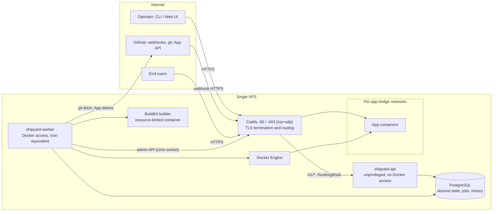
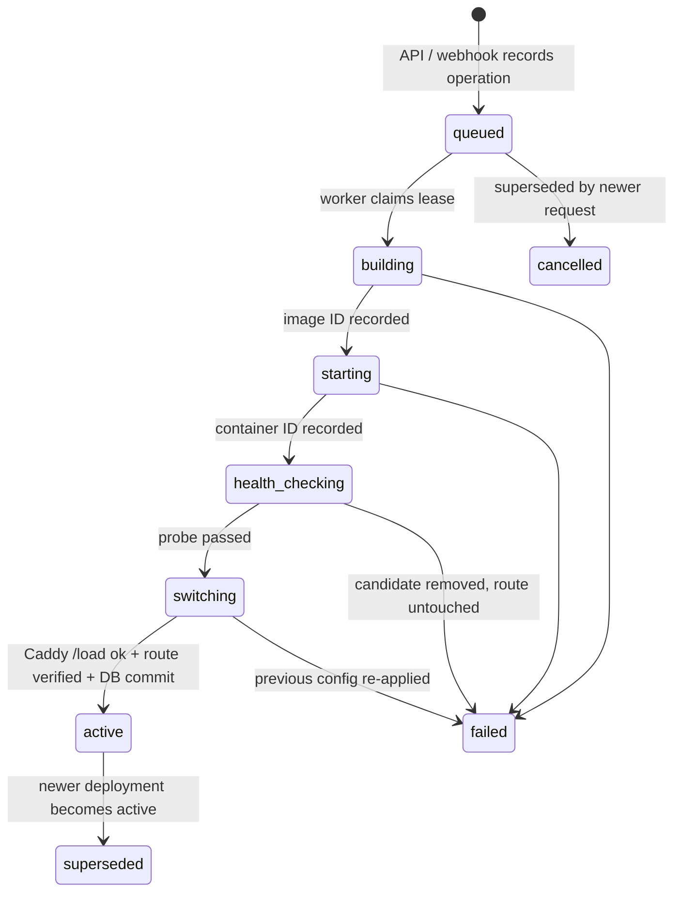

# Shipyard Architecture

> A self-hosted deployment platform for applications on a single VPS.

**Status:** Revised proposal, v2 (2026-09-25) · **Scope:** MVP and near-term evolution
**Supersedes:** [v1](archive/ARCHITECTURE-v1.md) · **What changed and why:** [architecture-review.md](architecture-review.md) · **Evidence:** [SOURCES.md](SOURCES.md) · **Plan:** [ROADMAP.md](ROADMAP.md)

Tags in square brackets, such as `[DK-LOG]`, refer to entries in [SOURCES.md](SOURCES.md). A claim about external behavior without a tag is a design choice, not a vendor fact.

## 1. Goals

Shipyard turns a Git repository with a Dockerfile into a running application behind HTTPS. A successful deployment has all of the following:

- a pinned commit SHA,
- an immutable image ID,
- an encrypted configuration revision,
- a health result,
- a route,
- a rollback target.

Goals:

- Deploy from a GitHub repository manually or through a verified webhook.
- Build a Docker image, start an isolated container, and publish it on a domain over HTTPS.
- Manage application configuration, deployments, logs, health, and rollback.
- Keep operations understandable on one Linux host before introducing distributed orchestration.

### Non-goals for the MVP

The MVP excludes multi-node scheduling, Kubernetes, buildpack detection, managed databases, horizontal autoscaling, a general CI service, and hosting mutually untrusted tenants. The first release accepts repositories that contain a Dockerfile.

### Trust model

Shipyard's MVP is software for **trusted operators deploying trusted repositories**. Single-host Docker isolation is not a strong boundary between hostile tenants. Access to the Docker daemon is root-equivalent `[DK-SEC][DK-POSTINSTALL]`. Every design choice below assumes this model. Relaxing it needs a new ADR.

### Platform baseline (verified 2026-09-25)

| Component | Baseline | Evidence |
| --- | --- | --- |
| Host OS | Linux with systemd and cgroup v2, e.g. Ubuntu 24.04 LTS or Debian 12+ | Design choice |
| Go | 1.26+ (1.27 is current; a release is supported until two newer majors ship) | `[GO-REL]` |
| PostgreSQL | 18 (17 acceptable), latest minor release | `[PG-VERSIONS]` |
| Docker Engine | 29.x with the containerd image store; API ≥ 1.44 | `[DK-29][DK-CONTAINERD]` |
| Docker Go SDK | `github.com/moby/moby/client` (the `github.com/docker/docker` module is deprecated) | `[DK-29]` |
| Builder | BuildKit through a dedicated `buildx` builder using the `docker-container` driver | `[DK-BUILDKIT][DK-BX-CONTAINER]` |
| Edge proxy | Caddy v2 with automatic HTTPS and the admin API on a Unix socket | `[CADDY-API][CADDY-HTTPS]` |

## 2. System boundary



Shipyard runs on one host. The pieces interact as follows:

- **The API never talks to the worker directly.** It authenticates requests, validates input, and records intent as rows in PostgreSQL.
- **The worker** claims those rows. It serializes operations per application, then builds, starts, health-checks, and routes releases.
- **PostgreSQL is the source of truth** for configuration, releases, operation state, and audit events.
- **Docker and Caddy hold derived state.** Docker runs the workloads. Caddy's routing config is rendered from database rows and reconciled after restarts.

### Process and privilege boundaries

| Process | Runs as | May reach | Must never reach |
| --- | --- | --- | --- |
| Caddy | Container attached to every app network. It alone publishes 80/tcp, 443/tcp, and 443/udp. | App containers, the API listener | Docker socket |
| `shipyard-api` | systemd service, dedicated unprivileged user, **not** in the `docker` group | PostgreSQL, key file (to seal secrets) | Docker socket, Caddy admin socket |
| `shipyard-worker` | systemd service in the `docker` group, which is root-equivalent `[DK-POSTINSTALL]` | Docker socket, Caddy admin socket, PostgreSQL, GitHub, key file | — |
| PostgreSQL | Host service on localhost or a Unix socket, or a container with **no** published port | — | Public network |
| BuildKit | Container managed by `buildx` (`docker-container` driver) with CPU and memory limits | Internet, for dependency downloads | Shipyard credentials, Docker socket |
| App containers | One user-defined bridge network per app, with hardened flags (§7) | Their own network, Caddy, outbound internet | Docker socket, host network, other apps' networks |

Docker-published ports bypass ufw rules `[DK-FW]`. Only Caddy publishes ports. PostgreSQL, the API, and app containers never use `-p`.

## 3. Components and responsibilities

| Component | Responsibility | Key boundary |
| --- | --- | --- |
| API | Authentication, authorization, validation, app and deployment endpoints, SSE streams | Never executes repository code, never calls Docker |
| Webhook receiver (inside API) | Verifies signature, delivery ID, repository, branch, and SHA, then records and enqueues. Returns 2XX within 10 s `[GH-BP]` | Rejects unverified, oversized, or duplicate deliveries before parsing business fields |
| Deployment worker | Claims durable jobs, coordinates fetch, build, launch, health, traffic switch, and cleanup | At most one running operation per app, enforced in the database |
| Source fetcher | Fetches the exact commit and verifies it is reachable from the tracked branch `[GH-FORKS]` | Credentials are never written into the build context or image |
| Builder | Builds an image from the Dockerfile on a dedicated, resource-limited BuildKit instance `[DK-BX-CONTAINER]` | Treats the source as untrusted code. Enforces time, CPU, memory, and log-size limits |
| Docker runtime adapter | Creates, starts, stops, and inspects labeled containers and collects logs | Narrow interface defined where it is used |
| Route manager | Renders the full Caddy JSON config from the `routes` table and applies it with `POST /load` `[CADDY-API]` | Only healthy candidates receive traffic, and config changes are atomic |
| Secret store | Seals and opens configuration values with envelope encryption `[OWASP-CRYPTO]` | Never returns plaintext through the API or logs. The KEK never enters PostgreSQL |
| Reconciler | Compares database intent with containers, routes, and branch heads at startup and periodically | Repairs interrupted operations idempotently |

## 4. Data model

The model is PostgreSQL-first. Every table has `id`, `created_at`, and `updated_at`. All timestamps are `timestamptz`.

| Entity | Key fields | Constraints and notes |
| --- | --- | --- |
| **User** | `name`, `role` | The MVP has a single admin (ADR-0007). `owner_id` exists everywhere so that adding multiple users later needs no migration. |
| **API token** | `user_id`, `prefix`, `sha256_hash`, `scopes[]`, `expires_at`, `last_used_at`, `revoked_at` | Tokens are `shp_` plus 32 random bytes. Only the hash is stored, and the plaintext is shown once. |
| **Application** | `owner_id`, `slug`, `repo_full_name`, `github_installation_id?`, `branch`, `dockerfile_path`, `build_context`, `internal_port`, `health_path`, `health_timeout`, `cpu_limit`, `memory_limit`, `stop_timeout`, `auto_deploy` | `slug` is unique and DNS-safe. `dockerfile_path` and `build_context` must stay inside the repository. |
| **Secret value** | `app_id`, `key`, `ciphertext`, `wrapped_dek`, `kek_id` | Immutable. The AAD binds `(app_id, key, value_id)`, so ciphertexts cannot be swapped between rows. |
| **Environment revision** | `app_id`, `number`, plus entries of `(key, secret_value_id \| plain_value)` | Immutable. Changing a key creates a new revision that reuses unchanged value rows **without decrypting them**. |
| **Deployment** | `app_id`, `kind` (`build`/`rollback`), `source_commit_sha`, `image_id`, `build_metadata` (jsonb), `env_revision_id`, `container_id`, `status`, `failure_reason`, phase timestamps | `status` ∈ `queued, building, starting, health_checking, switching, active, superseded, failed, cancelled`. |
| **Operation** | `app_id`, `kind`, `idempotency_key`, `status`, `phase`, `payload`, `lease_owner`, `lease_expires_at`, `attempt`, `max_attempts`, `run_after`, `last_error` | `UNIQUE(idempotency_key)`, plus a partial unique index on `(app_id) WHERE status = 'running'` (one running op per app). |
| **Operation event** | `operation_id`, `seq`, `ts`, `level`, `message` | Append-only. `seq` is the SSE `id` for `Last-Event-ID` resume `[WHATWG-SSE]`. Size-bounded and redacted. |
| **Webhook delivery** | `delivery_id` (PK), `event`, `repository_id`, `ref`, `after_sha`, `received_at`, `outcome` | Primary key on the GitHub delivery GUID. Redeliveries reuse it `[GH-BP]`. |
| **Route** | `hostname` (unique), `app_id`, `deployment_id`, `upstream`, `dns_checked_at` | One app per hostname. The Caddy config is a pure function of this table. |
| **Audit event** | `actor`, `action`, `target`, `ts`, `result`, `request_id` | Append-only, with no secret values. |

**Rollback artifacts.** A deployment references an immutable **image ID** and an **environment revision**.

- Tags such as `shipyard/<app>:<sha12>` are for humans only. Containers are always created from the image ID.
- The build metadata (`containerimage.digest`, `containerimage.config.digest`) is stored for provenance `[DK-BX-BUILD]`.

**Retention** is explicit and configurable. By default, Shipyard keeps the images of the last 5 successful deployments per app, keeps all deployment rows, and caps the BuildKit cache (ADR-0006).

## 5. Deployment lifecycle



**Rule:** persist the phase *before* each side effect, and make each side effect idempotent. Idempotency comes from deterministic names, labels, and keys. A crash at any point then leaves enough state to retry or compensate.

1. **Admission (API).** Validate the request and insert an operation.
   - For webhooks, the idempotency key is `gh:<X-GitHub-Delivery>`, so a redelivery does not create a second deployment `[GH-BP]`.
   - For manual deploys, the key comes from the client's `Idempotency-Key` header, or the API generates one.
   - A newer request for an app cancels that app's still-`queued` deploy. Latest wins, and a running operation is never interrupted.
2. **Claim (worker).** Select the oldest eligible operation with `FOR UPDATE SKIP LOCKED` and set `status = running`, `lease_owner`, and `lease_expires_at` `[PG-SELECT]`.
   - The partial unique index guarantees one running operation per app.
   - A heartbeat extends the lease.
   - `LISTEN/NOTIFY` may wake the worker, but polling stays the fallback.
3. **Fetch.** Fetch the exact SHA over HTTPS. For private repositories, use a one-hour installation token scoped to that repository with `contents: read` `[GH-APP-TOKEN]`, passed as a git header, never in the URL.
   - **Verify that the SHA is an ancestor of the tracked branch**, for example with `git merge-base --is-ancestor`. Fork commits are reachable through the upstream network `[GH-FORKS]`.
   - Reject Dockerfile or context paths that escape the checkout.
4. **Build.** Run `docker buildx build --builder shipyard --load --metadata-file … --label io.shipyard.*` on the resource-limited builder, under a context deadline `[DK-BX-CONTAINER][DK-BX-BUILD]`.
   - No Shipyard credentials go into the build: no build args, no environment `[DK-BUILD-SECRETS]`.
   - Record the image ID and build metadata. Stream bounded build logs to operation events.
5. **Start the candidate.**
   - Name it `shipyard-<app>-<deployment-id>` and attach it to network `shipyard-app-<app>`.
   - Apply the hardened flags from §7, `--restart unless-stopped`, and the `local` log driver.
   - Inject the decrypted revision as environment variables. No port is published.
   - Persist the container ID before starting it.
6. **Health gate.** The worker probes `http://<container-ip>:<internal_port><health_path>` until it sees N consecutive 2xx/3xx responses or `health_timeout` expires. The container must also stay `running` without restarts. The default path is `/`, and each app can override it.
7. **Switch traffic.**
   - Render the full Caddy config with this app's upstream pointing at the candidate.
   - Apply it with `POST /load` and `If-Match: <etag>`. Caddy applies it atomically with zero downtime, or rolls back `[CADDY-API]`.
   - Verify the route through Caddy using the app's `Host` header.
   - Only then commit, in one transaction: the route's `deployment_id`, the candidate as `active`, and the previous deployment as `superseded`.
8. **Observe and drain.** Keep the previous container for an observation window (default 5 min). Then run `docker stop` with the app's `stop_timeout`, which sends `SIGTERM` and later `SIGKILL` (Docker's default is 10 s `[DK-RUN]`), and remove the container. The image stays, subject to retention.

### Failure handling

| Failure | Effect on traffic | Action |
| --- | --- | --- |
| Fetch, ancestry, or build fails | None | Mark failed, keep bounded logs, clean the workspace. |
| Candidate exits or fails health | None | Mark failed, capture the last log lines, remove the candidate. |
| `POST /load` rejected | None (Caddy kept the old config) | Mark failed and remove the candidate. |
| Route verification fails after load | Briefly on candidate | Re-render from the DB (old target), `POST /load`, mark failed. |
| Worker crash in any phase | Unchanged, or equal to the DB | The lease expires and the reconciler resumes or compensates using the phase, labels, and the `routes` table. |

### Rollback

Rollback is a new operation with `kind = rollback` that targets a prior successful deployment.

- It starts a container from that deployment's retained **image ID** and **original environment revision**, confirms health, switches the route, and records the new active state.
- If the image is gone, the API reports that rollback is unavailable. It never silently rebuilds from a moving branch.
- If a secret in the target revision has since been rotated, the CLI warns and offers `--with-current-config`.

### Reconciler

The reconciler runs at worker start and then every 60 s by default.

1. Re-queue operations whose leases expired, incrementing `attempt`. Once `max_attempts` is exceeded, mark them failed.
2. List containers labelled `io.shipyard.managed=true`. Remove orphaned candidates, and recreate a missing active container from its image ID.
3. Render the Caddy config from `routes`. If it differs from the running config, `POST /load` it.
4. For `auto_deploy` apps, compare the tracked branch head with the last deployed SHA and enqueue missed pushes. GitHub does not auto-redeliver failed webhooks `[GH-REDELIVER]`.

## 6. API and CLI shape

| CLI example | API operation |
| --- | --- |
| `shipyard app create --repo owner/repo --branch main --port 3000` | `POST /v1/apps` |
| `shipyard deploy APP [--ref <commit-sha>]` | `POST /v1/apps/{id}/deployments` (with `Idempotency-Key`) |
| `shipyard ps` | `GET /v1/apps` |
| `shipyard logs APP --follow` | `GET /v1/apps/{id}/logs` (SSE) |
| `shipyard events OPERATION` | `GET /v1/operations/{id}/events` (SSE, resumable) |
| `shipyard rollback APP --to <deployment-id>` | `POST /v1/apps/{id}/rollbacks` |
| `shipyard env set APP KEY` (value read from **stdin**) | `PUT /v1/apps/{id}/env/{key}` → new environment revision |
| `shipyard domain set APP example.com` | `PUT /v1/apps/{id}/domain` (DNS preflight) |
| — | `POST /hooks/github` (public, HMAC-verified) |

- **Routing and errors.** Standard-library routing (`GET /v1/apps/{id}`) is sufficient, so no router framework is needed `[GO-ROUTING]`. Errors use `application/problem+json` `[RFC9457]`.
- **Environment changes.** A changed environment creates a new revision, which takes effect on the next deploy. Use `--redeploy` to apply it now.
- **Streaming.** Use SSE for one-way live logs and events `[WHATWG-SSE]`:
  - Every event carries an `id`, so clients can resume with `Last-Event-ID`.
  - The server sends a `:` keepalive comment about every 15 s.
  - The API is served over HTTP/2 through Caddy, which avoids the browser limit of 6 connections that applies over HTTP/1.1 `[MDN-SSE]`. Caddy flushes `text/event-stream` immediately `[CADDY-RP]`.
  - Introduce WebSockets only when bidirectional interaction is needed.
- **Log limits.** Historical logs are bounded tails. Known secret values are redacted, but redaction cannot catch every secret an app prints.

## 7. Security and operational defaults

**Access**

- The API and CLI require bearer tokens with scopes and expiry. Every mutation writes an audit event.
- The API listens on localhost or a Unix socket and is exposed only through Caddy over TLS.
- The webhook path is the only unauthenticated public endpoint, and it must pass HMAC verification.

**GitHub** `[GH-VALIDATE][GH-BP][GH-EVENTS]`

- Read the raw body with a 25 MB cap, which is GitHub's maximum payload.
- Verify `X-Hub-Signature-256` (`sha256=` plus hex HMAC-SHA256) with `hmac.Equal`, before parsing JSON. Ignore the legacy SHA-1 header.
- Deduplicate on `X-GitHub-Delivery`.
- Ignore pushes with `deleted: true`, pushes to other refs, and repositories not mapped to an app.
- Answer within 10 s. The receiver only records and enqueues.
- Use a GitHub App for private repositories. JWTs are RS256, `exp` ≤ 10 min, and `iat` −60 s `[GH-APP-JWT]`. Installation tokens are per operation and per repository `[GH-APP-TOKEN]`.

**Builds** `[DK-BX-CONTAINER][DK-BX-BUILD][DK-BUILD-SECRETS]`

- Use a dedicated `buildx` builder (`docker-container` driver) with `memory`/`cpu-quota` driver options.
- Enforce a per-build deadline and a bounded log size.
- Never pass credentials as build args or environment variables.
- Leave builder network access on in the MVP, because most builds download dependencies. Egress restriction is a Phase 5 hardening item.

**Containers** `[DK-RUN][DK-SEC][DK-BRIDGE]`

- Always apply: `--cap-drop ALL`, with capabilities added back per app only from an allowlist; `--security-opt no-new-privileges`; `--pids-limit`; `--memory`; `--cpus`; `--restart unless-stopped`; the `local` log driver; one user-defined network per app.
- Never use: `--privileged`, `--network host`, the Docker socket, host bind mounts, or `-p`.
- `--read-only` and `--init` are opt-in per app.

**Docker daemon** `[DK-LOG][DK-LOG-LOCAL][DK-LIVE]`

- `/etc/docker/daemon.json` sets `"log-driver": "local"`, which rotates at 5 × 20 MB per container by default. The default `json-file` driver never rotates.
- It also sets `"live-restore": true`, so patch upgrades of the daemon do not stop apps.
- Only the worker's user is in the `docker` group. Rootless Docker is evaluated in Phase 5 `[DK-ROOTLESS]`.

**Caddy** `[CADDY-API][CADDY-OPTIONS][CADDY-HTTPS]`

- The admin API listens on a Unix socket in a directory that only Caddy and the worker can access. App containers share a network with Caddy, so a TCP admin listener would let them rewrite routes.
- Mount the data directory (certificates and ACME account) as a persistent volume and back it up.

**Domains and TLS** `[CADDY-HTTPS][LE-LIMITS]`

- Before adding a route, check that the hostname's A/AAAA records point to this host. Failed validations count against Let's Encrypt limits (5 failures per identifier per hour, and 5 certificates per identical identifier set per 7 days).
- One app per hostname. An optional allow-list of domain suffixes restricts what users can claim.
- Never enable on-demand TLS without an `ask` endpoint.
- Development and CI use the Let's Encrypt staging CA.

**Secrets** `[OWASP-CRYPTO][GO-GCM]`

- Use envelope encryption. Each value gets a random DEK and is encrypted with AES-256-GCM (`cipher.NewGCMWithRandomNonce`), with AAD `(app_id, key, value_id)`. The DEK is wrapped by a KEK that carries a `kek_id`.
- Keep the KEK in a root-owned file readable only by the `shipyard` group (`0640`, shared by the API and worker users) or in a systemd credential. It is **never in PostgreSQL** and never in the same backup as the database.
- Document and test rotation and recovery before production (ADR-0005).

**Host firewall** `[DK-FW]`

- Allow 22/tcp, 80/tcp, 443/tcp, and 443/udp.
- Because ufw does not filter published Docker ports, the real control is that nothing but Caddy publishes ports.

**Reliability**

- Persist operation phases, use leases with expiry, and treat duplicate events as normal.
- Monitor disk usage for images, the build cache, and logs.
- Back up PostgreSQL nightly with `pg_dump -Fc`, and back up the KEK and the Caddy data directory to separate off-host locations.
- Restores are **tested**, not assumed.

**Observability**

- Emit structured logs (`log/slog`) that carry `request_id`, `operation_id`, `app`, and `deployment_id`.
- Expose Prometheus metrics on an internal listener: deployment duration, failure rate, health state, queue depth, disk usage, and certificate expiry.

## 8. Repository layout

```text
cmd/shipyard/          CLI
cmd/shipyard-api/      HTTP server and webhook receiver
cmd/shipyard-worker/   deployment worker and reconciler
internal/api/          handlers, authn/authz, problem+json errors, SSE
internal/webhook/      GitHub signature verification and event mapping
internal/app/          deployment use cases and state transitions (pure logic)
internal/queue/        operation claim/lease/heartbeat on PostgreSQL
internal/source/       git fetch, ancestry check, GitHub App tokens
internal/build/        BuildKit/buildx invocation and metadata capture
internal/runtime/      Docker container lifecycle (moby client)
internal/routing/      Caddy config rendering and admin API client
internal/reconcile/    startup and periodic reconciliation
internal/secrets/      envelope encryption and environment revisions
internal/store/        PostgreSQL persistence (pgx)
internal/audit/        audit event recording
internal/config/       process configuration
migrations/            forward-only SQL migrations
deploy/                systemd units, daemon.json, Caddy bootstrap config, install script
test/e2e/              end-to-end tests against real Docker, PostgreSQL, and Caddy
web/                   optional React UI (Phase 6)
docs/                  architecture, ADRs, roadmap, work log, operator guide
```

Keep interfaces narrow and define them where they are used. A future `Runtime` interface can support other backends once Docker behavior is proven. Do not add Kubernetes abstractions before a second runtime exists.

## 9. Delivery plan

The phased plan, with exit criteria, lives in [ROADMAP.md](ROADMAP.md). It differs from v1 in three ways:

- **Encrypted secrets and baseline container hardening move into the Foundation phase.** Deployments reference environment revisions from day one, and retrofitting encryption would mean migrating plaintext secrets.
- **Crash-safety is designed in Phase 1 and proven in Phase 3.** Leases and phases come first; the reconciler comes later.
- **The acceptance demo adds a restore-from-backup drill.**

**Acceptance demo (MVP exit):**

1. On a fresh VPS, install Shipyard and connect a sample repository.
2. Deploy it over HTTPS.
3. Push a working change, then push a broken change and show that the prior release still serves traffic.
4. Roll back to an earlier healthy release.
5. Kill the worker mid-deploy and show that the system reaches a consistent state.
6. Restore the database and key from backup onto a fresh host.

## 10. Design decisions

The five open questions from v1 now have proposed defaults, each recorded as an ADR and pending the owner's acceptance:

| Question (v1 §10) | Proposed default | ADR |
| --- | --- | --- |
| One administrator or several users? | Single admin for the MVP. The schema keeps `owner_id` and scopes for later RBAC. | [ADR-0007](adr/0007-mvp-trust-model.md) |
| Which build path, and how is it isolated? | Dockerfile only, built on a dedicated resource-limited BuildKit builder with no credentials. Egress limits in Phase 5. | [ADR-0004](adr/0004-image-build-and-identity.md) |
| One app per domain? How is ownership verified? | Unique hostname per app, DNS preflight, optional suffix allow-list. ACME performs the control proof. | [ADR-0003](adr/0003-caddy-routing-via-admin-socket.md) |
| Retention defaults? | Last 5 successful images per app, capped build cache, and container logs at 5 × 20 MB. | [ADR-0006](adr/0006-retention-and-backup.md) |
| Which backup/restore procedure? | Nightly `pg_dump -Fc`, plus the KEK and Caddy data kept separately off-host, and a restore drill before 1.0. | [ADR-0006](adr/0006-retention-and-backup.md) |

**Still open**

- Whether to expose the admin API publicly at all, or only over SSH or a VPN.
- Whether to support private registries or image pushes.
- How many concurrent builds a small VPS can take. The starting point is 1.
