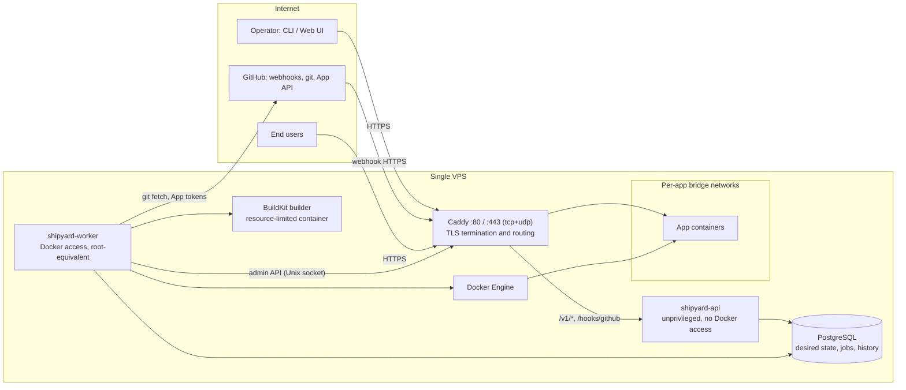
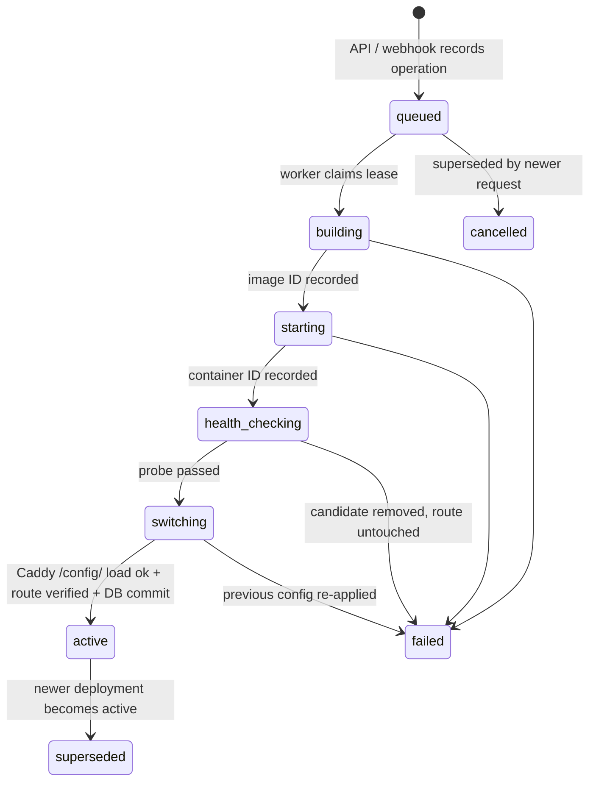

# Shipyard Architecture

> A self-hosted deployment platform for applications on a single VPS.

**Status:** Accepted, v2 (2026-09-25) · **Scope:** MVP and near-term evolution
**Supersedes:** [v1](archive/ARCHITECTURE-v1.md) · **What changed and why:** [architecture-review.md](architecture-review.md) · **Evidence:** [SOURCES.md](SOURCES.md) · **Plan:** [ROADMAP.md](ROADMAP.md)

Tags in square brackets, such as `[DK-LOG]`, refer to entries in [SOURCES.md](SOURCES.md). A claim about external behavior without a tag is a design choice, not a vendor fact.

## 1. Goals

Shipyard turns a Git repository with a Dockerfile into a running application behind HTTPS. A successful deployment has all of the following:

- a pinned commit SHA,
- an immutable image ID,
- an encrypted configuration revision,
- a health result,
- a route,
- a rollback target.

Goals:

- Deploy from a GitHub repository manually or through a verified webhook.
- Build a Docker image, start an isolated container, and publish it on a domain over HTTPS.
- Manage application configuration, deployments, logs, health, and rollback.
- Keep operations understandable on one Linux host before introducing distributed orchestration.

### Non-goals for the MVP

The MVP excludes multi-node scheduling, Kubernetes, buildpack detection, managed databases, horizontal autoscaling, a general CI service, and hosting mutually untrusted tenants. The first release accepts repositories that contain a Dockerfile.

### Trust model

Shipyard's MVP is software for **trusted operators deploying trusted repositories**. Single-host Docker isolation is not a strong boundary between hostile tenants. Access to the Docker daemon is root-equivalent `[DK-SEC][DK-POSTINSTALL]`. Every design choice below assumes this model. Relaxing it needs a new ADR.

### Platform baseline (verified 2026-09-25)

| Component | Baseline | Evidence |
| --- | --- | --- |
| Host OS | Linux with systemd and cgroup v2, e.g. Ubuntu 24.04 LTS or Debian 12+ | Design choice |
| Go | 1.26+ (1.27 is current; a release is supported until two newer majors ship). The toolchain is pinned to go1.26.8 until staticcheck supports 1.27 | `[GO-REL][STATICCHECK]` |
| PostgreSQL | 18 (17 acceptable), latest minor release | `[PG-VERSIONS]` |
| Docker Engine | 29.x with the containerd image store; API ≥ 1.44 | `[DK-29][DK-CONTAINERD]` |
| Docker Go SDK | `github.com/moby/moby/client` (the `github.com/docker/docker` module is deprecated) | `[DK-29]` |
| Builder | BuildKit through a dedicated `buildx` builder using the `docker-container` driver | `[DK-BUILDKIT][DK-BX-CONTAINER]` |
| Edge proxy | Caddy v2 with automatic HTTPS and the admin API on a Unix socket | `[CADDY-API][CADDY-HTTPS]` |

## 2. System boundary


```mermaid
flowchart LR
  subgraph EXT["Internet"]
    U["Operator: CLI / Web UI"]
    GH["GitHub: webhooks, git, App API"]
    EU["End users"]
  end
  subgraph HOST["Single VPS"]
    CD["Caddy :80 / :443 (tcp+udp)<br/>TLS termination and routing"]
    API["shipyard-api<br/>unprivileged, no Docker access"]
    DB[("PostgreSQL<br/>desired state, jobs, history")]
    W["shipyard-worker<br/>Docker access, root-equivalent"]
    BK["BuildKit builder<br/>resource-limited container"]
    DK["Docker Engine"]
    subgraph NETS["Per-app bridge networks"]
      C["App containers"]
    end
  end
  U -- HTTPS --> CD
  GH -- "webhook HTTPS" --> CD
  EU -- HTTPS --> CD
  CD -- "/v1/*, /hooks/github" --> API
  CD --> C
  API --> DB
  W --> DB
  W -- "git fetch, App tokens" --> GH
  W -- "admin API (Unix socket)" --> CD
  W --> BK
  W --> DK
  DK --> C
```

Shipyard runs on one host. The pieces interact as follows:

- **The API never talks to the worker directly.** It authenticates requests, validates input, and records intent as rows in PostgreSQL.
- **The worker** claims those rows. It serializes operations per application, then builds, starts, health-checks, and routes releases.
- **PostgreSQL is the source of truth** for configuration, releases, operation state, and audit events.
- **Docker and Caddy hold derived state.** Docker runs the workloads. Caddy's routing config is rendered from database rows and reconciled after restarts.

### Process and privilege boundaries

| Process | Runs as | May reach | Must never reach |
| --- | --- | --- | --- |
| Caddy | Container attached to every app network. It alone publishes 80/tcp, 443/tcp, and 443/udp. | App containers, the API listener | Docker socket |
| `shipyard-api` | systemd service, dedicated unprivileged user, **not** in the `docker` group | PostgreSQL, key file (to seal secrets) | Docker socket, Caddy admin socket |
| `shipyard-worker` | systemd service in the `docker` group, which is root-equivalent `[DK-POSTINSTALL]` | Docker socket, Caddy admin socket, PostgreSQL, GitHub, key file | — |
| PostgreSQL | Host service on localhost or a Unix socket, or a container with **no** published port | — | Public network |
| BuildKit | Container managed by `buildx` (`docker-container` driver) with CPU and memory limits | Internet, for dependency downloads | Shipyard credentials, Docker socket |
| App containers | One user-defined bridge network per app, with hardened flags (§7) | Their own network, Caddy, outbound internet | Docker socket, host network, other apps' networks |

Docker-published ports bypass ufw rules `[DK-FW]`. Only Caddy publishes ports. PostgreSQL, the API, and app containers never use `-p`.

## 3. Components and responsibilities

| Component | Responsibility | Key boundary |
| --- | --- | --- |
| API | Authentication, authorization, validation, app and deployment endpoints, SSE streams | Never executes repository code, never calls Docker |
| Webhook receiver (inside API) | Verifies signature, delivery ID, repository, branch, and SHA, then records and enqueues. Returns 2XX within 10 s `[GH-BP]` | Rejects unverified, oversized, or duplicate deliveries before parsing business fields |
| Deployment worker | Claims durable jobs, coordinates fetch, build, launch, health, traffic switch, and cleanup | At most one running operation per app, enforced in the database |
| Source fetcher | Fetches the exact commit and verifies it is reachable from the tracked branch `[GH-FORKS]` | Credentials are never written into the build context or image |
| Builder | Builds an image from the Dockerfile on a dedicated, resource-limited BuildKit instance `[DK-BX-CONTAINER]` | Treats the source as untrusted code. Enforces time, CPU, memory, and log-size limits |
| Docker runtime adapter | Creates, starts, stops, and inspects labeled containers and collects logs | Narrow interface defined where it is used |
| Route manager | Renders the full Caddy JSON config from the `routes` table and replaces Caddy's config with it (`POST /config/` + `If-Match`) `[CADDY-API][CADDY-ADMIN-SRC]` | Only healthy candidates receive traffic, and config changes are atomic |
| Secret store | Seals and opens configuration values with envelope encryption `[OWASP-CRYPTO]` | Never returns plaintext through the API or logs. The KEK never enters PostgreSQL |
| Reconciler | Compares database intent with containers, routes, and branch heads at startup and periodically | Repairs interrupted operations idempotently |

## 4. Data model

The model is PostgreSQL-first, implemented in [`migrations/0002_schema_v1.sql`](../migrations/0002_schema_v1.sql). All timestamps are `timestamptz`.

- **IDs** are `uuid` from `gen_random_uuid()` `[PG-UUID]`. They are not enumerable through the API and work on PostgreSQL 17 and 18.
- **Mutable tables** have `created_at` and a trigger-maintained `updated_at`. **Immutable and append-only tables** (secret values, environment revisions and their entries, operation events, audit events) have `created_at` only, and a trigger rejects `UPDATE`. Audit events also reject `DELETE`.
- **Same-app references** use composite foreign keys on `(app_id, id)`. The database refuses a deployment that uses another app's operation, environment revision, or rollback source, and a route that points at another app's deployment.

| Entity | Key fields | Constraints and notes |
| --- | --- | --- |
| **User** | `name`, `role` | The MVP has a single admin (ADR-0007). `owner_id` exists everywhere so that adding multiple users later needs no migration. |
| **API token** | `user_id`, `name`, `prefix`, `sha256_hash`, `scopes[]`, `expires_at`, `last_used_at`, `revoked_at` | Tokens are `shp_` plus 32 random bytes. Only the hash is stored, and the plaintext is shown once. |
| **Application** | `owner_id`, `slug`, `repo_full_name`, `github_installation_id?`, `branch`, `dockerfile_path`, `build_context`, `internal_port`, `health_path`, `health_timeout`, `cpu_limit`, `memory_limit`, `stop_timeout`, `auto_deploy` | `slug` is unique and DNS-safe. `dockerfile_path` and `build_context` must stay inside the repository. |
| **Secret value** | `app_id`, `key`, `ciphertext`, `wrapped_dek`, `kek_id` | Immutable. The AAD binds `(app_id, key, value_id)`, so ciphertexts cannot be swapped between rows. |
| **Environment revision** | `app_id`, `number`, plus entries of `(key, secret_value_id \| plain_value)` in `env_revision_entries` | Immutable. Changing a key creates a new revision that reuses unchanged value rows **without decrypting them**. An entry's secret must have the same app and key. |
| **Deployment** | `app_id`, `operation_id`, `kind` (`build`/`rollback`), `source_deployment_id` (rollback only), `source_commit_sha`, `image_id`, `build_metadata` (jsonb), `env_revision_id`, `container_id`, `status`, `failure_reason`, phase timestamps | `status` ∈ `queued, building, starting, health_checking, switching, active, superseded, failed, cancelled`. At most one `active` per app (partial unique index). From `health_checking` on, `image_id` and `container_id` are required. `failed` requires a `failure_reason`. |
| **Operation** | `app_id`, `kind`, `idempotency_key`, `status`, `phase`, `payload`, `lease_owner`, `lease_expires_at`, `attempt`, `max_attempts`, `run_after`, `last_error` | `UNIQUE(idempotency_key)`, plus a partial unique index on `(app_id) WHERE status = 'running'` (one running op per app). |
| **Operation event** | `operation_id`, `seq`, `ts`, `level`, `message` | Append-only. `seq` is the SSE `id` for `Last-Event-ID` resume `[WHATWG-SSE]`. Size-bounded and redacted. |
| **Webhook delivery** | `delivery_id` (PK), `event`, `repository_id`, `ref`, `after_sha`, `received_at`, `outcome` | Primary key on the GitHub delivery GUID. Redeliveries reuse it `[GH-BP]`. |
| **Route** | `hostname` (unique), `app_id`, `deployment_id`, `upstream`, `dns_checked_at` | One app per hostname. The Caddy config is a pure function of this table. |
| **Audit event** | `actor`, `action`, `target`, `ts`, `result`, `request_id` | Append-only, with no secret values. |

**Rollback artifacts.** A deployment references an immutable **image ID** and an **environment revision**.

- Tags such as `shipyard/<app>:<sha12>` are for humans only. Containers are always created from the image ID.
- The build metadata (the whole `--metadata-file` output: `containerimage.digest`, `containerimage.descriptor`, and `containerimage.config.digest` when buildx reports it) is stored for provenance `[DK-BX-BUILD]`. On the containerd image store, the image ID equals `containerimage.digest`.

**Retention** is explicit and configurable. By default, Shipyard keeps the images of the last 5 successful deployments per app, keeps all deployment rows, and caps the BuildKit cache (ADR-0006).

- As implemented for images (P3.4a, `app.ImagePruner`, Reconciler step 5):
  - **Kept:** per app, the active release's image, and the images of the last `SHIPYARD_RETAIN_IMAGES` (default 5) superseded releases, ranked by when each image last served. An image served twice (a rollback to it) counts once. Also kept: images of deployments still in progress, and the target of a queued or running rollback.
  - **Removed:** every other image a deployment in this database recorded, including failed deploys' images and older releases'. Rebuilding a commit leaves the previous image untagged (`DK-RMI`), so images are listed by the `io.shipyard.managed` label, not by name.
  - **Never touched:** an image no deployment here recorded. It belongs to another installation, or to a build whose ID is not persisted yet.
  - **Removal is never forced.** Docker keeps an image a container uses, running or stopped, or one with a second tag (`DK-RMI`), and the next pass tries again. A second tag is an operator's way to keep an image.
  - The consequence: a rollback to an older release is "unavailable" (P3.3). The history keeps the row.
- As implemented for the rest (P3.4b, `app.Retention`): a job in the worker runs at start and then every `SHIPYARD_RETENTION_INTERVAL` (default 24 h).
  - **Build cache:** `buildx prune --max-used-space` down to `SHIPYARD_BUILD_CACHE_MAX` (default 10 GiB) on the `shipyard` builder, least recently used first `[DK-BX-PRUNE]`. It takes the builder's one slot, so it never runs beside a build.
  - **Operation events** (the build and deploy logs), for finished operations only, so a live stream never loses events:
    - an operation beyond each app's newest `SHIPYARD_RETAIN_OPERATIONS` (default 20) loses its events; the operation row stays;
    - an operation whose events exceed `SHIPYARD_OPERATION_LOG_MAX` (default 5 MiB) keeps the first and last half of that, plus every warning and error. The gap becomes one warning at the first removed seq, so `Last-Event-ID` resume still works. A second pass changes nothing.
  - One build's log is already capped at 5 MB (ADR-0004); the event cap covers retries and the rest.

## 5. Deployment lifecycle


```mermaid
stateDiagram-v2
  [*] --> queued: API / webhook records operation
  queued --> building: worker claims lease
  building --> starting: image ID recorded
  starting --> health_checking: container ID recorded
  health_checking --> switching: probe passed
  switching --> active: Caddy /config/ load ok + route verified + DB commit
  building --> failed
  starting --> failed
  health_checking --> failed: candidate removed, route untouched
  switching --> failed: previous config re-applied
  active --> superseded: newer deployment becomes active
  queued --> cancelled: superseded by newer request
```

**Rule:** persist the phase *before* each side effect, and make each side effect idempotent. Idempotency comes from deterministic names, labels, and keys. A crash at any point then leaves enough state to retry or compensate.

1. **Admission (API).** Validate the request and insert an operation.
   - For webhooks, the idempotency key is `gh:<X-GitHub-Delivery>:<app slug>`, so a redelivery does not create a second deployment `[GH-BP]`. The slug is there because one push can deploy several apps (P4.2).
   - For manual deploys, the key comes from the client's `Idempotency-Key` header, or the API generates one.
   - A newer request for an app cancels that app's still-`queued` operations. Latest wins, and a running operation is never interrupted. A row lock on the app serializes admissions, so concurrent requests leave exactly one queued.
   - Reusing an idempotency key for a different app or kind is refused.
   - Admission writes only the operation. The worker creates the deployment row when it starts the operation, so a cancelled request never has a deployment.
2. **Claim (worker).** Select the oldest eligible operation with `FOR UPDATE SKIP LOCKED` and set `status = running`, `lease_owner`, `lease_expires_at`, and `attempt + 1` `[PG-SELECT]`.
   - Apps with a running operation are skipped. The partial unique index still guarantees one running operation per app when two workers race; the loser retries on other apps.
   - A heartbeat every lease/3 (lease 60 s by default) extends the lease. Phase changes, completion, and failure all require the caller to still own the lease. When a renewal fails or a whole lease passes without one, the worker cancels its own work.
   - A failure can be retried after a delay while attempts remain (default 3).
   - `LISTEN/NOTIFY` may wake the worker, but polling (every 2 s) stays the fallback.
3. **Fetch.** Fetch the exact SHA over HTTPS. For private repositories, use a one-hour installation token scoped to that repository with `contents: read` `[GH-APP-TOKEN]`, passed as a git header, never in the URL.
   - **Verify that the SHA is an ancestor of the tracked branch** with `git merge-base --is-ancestor` `[GIT-MERGE-BASE]`. Fork commits are reachable through the upstream network `[GH-FORKS]`.
   - How: a blobless, single-branch clone (`--filter=blob:none --single-branch`) into `<work>/op-<operation-id>`, emptied first on every retry. It has every commit of the branch but only the files of the commit checked out. A SHA missing from that history is refused without fetching anything else: the history and ancestry checks run with `GIT_NO_LAZY_FETCH=1`, because a partial clone otherwise downloads a missing commit on demand, even one from another branch or a fork `[GIT-PARTIAL]`.
   - git runs without a shell, ignores the host's git config (`GIT_CONFIG_GLOBAL=/dev/null`, `GIT_CONFIG_NOSYSTEM`), never prompts, and allows only the base URL's transport (`protocol.allow=never` plus one exception). The token travels as an `http.extraHeader` in the environment `[GIT-CONFIG]`, never in argv, the URL, or `.git/config`.
   - Reject Dockerfile or context paths that escape the checkout, **after resolving symlinks** (`Checkout.Path`).
4. **Build.** Run `docker buildx build --builder shipyard --load --metadata-file … --label io.shipyard.*` on the resource-limited builder, under a context deadline `[DK-BX-CONTAINER][DK-BX-BUILD]`.
   - No Shipyard credentials go into the build: no build args, no environment `[DK-BUILD-SECRETS]`.
   - Record the image ID and build metadata. Stream bounded build logs to operation events.
5. **Start the candidate.**
   - Name it `shipyard-<app>-<deployment-id>` and attach it to network `shipyard-app-<app>`.
   - Apply the hardened flags from §7, `--restart unless-stopped`, and the `local` log driver.
   - Inject the decrypted revision as environment variables. No port is published.
   - Persist the container ID before starting it.
6. **Health gate.** The worker probes `http://<container-ip>:<internal_port><health_path>` until it sees N consecutive 2xx/3xx responses or `health_timeout` expires. The container must also stay `running` without restarts. The default path is `/`, and each app can override it.
7. **Switch traffic.**
   - Render the full Caddy config with this app's upstream pointing at the candidate.
   - Apply it as a whole-config replace, `POST /config/` with `If-Match: <etag>` (`routing.Admin.Apply`). Caddy applies it atomically with zero downtime, or rolls back `[CADDY-API]`. `/load` would ignore `If-Match` `[CADDY-ADMIN-SRC]`.
   - Verify the route through Caddy using the app's `Host` header.
   - Only then commit, in one transaction: the route's `deployment_id`, the candidate as `active`, and the previous deployment as `superseded`.
   - As implemented (P2.4, `routing.Router` and `deploy.switchTraffic`):
     - **Order.** The deployment is marked `switching`. The rendered config points the app's routes at `<candidate container name>:<internal_port>`, which Caddy resolves on the app network `[DK-BRIDGE]`. That config is loaded.
     - **Verification.** Each hostname gets `health_path` requested on Caddy's **verify server**: a plain-HTTP server on `caddy-verify.sock`, next to the admin socket (mode 0660), with the same routes and automatic HTTPS skipped. It proves the routing through Caddy without waiting for a certificate.
     - **Commit.** Only the verified hostnames are committed. A route added meanwhile keeps its target, and a verified route deleted meanwhile aborts the commit.
     - **Failure.** On a failed load, verification, or commit, Caddy is first restored from the routes table, then the candidate is removed.
     - **Lost lease or shutdown.** The routes are restored, but nothing is recorded; the next owner resumes and switches again.
     - **Restore fails too.** The next worker start restores (Reconciler step 3).
8. **Observe and drain.** Keep the previous container for an observation window (default 5 min). Then run `docker stop` with the app's `stop_timeout`, which sends `SIGTERM` and later `SIGKILL` (Docker's default is 10 s `[DK-RUN]`), and remove the container. The image stays, subject to retention.
   - As implemented (P2.6, `app.Janitor`, Reconciler step 2):
     - **No drain in the deploy.** Activation leaves the previous container running and logs the window and stop timeout to the operation's events.
     - **Who drains.** The reconciler does, after its Caddy sync. A `superseded` deployment whose `ended_at` plus the window has passed is stopped with its app's `stop_timeout`, then removed. The decision comes from the database, so a worker restart loses nothing.
     - **Setting.** `SHIPYARD_OBSERVATION_WINDOW` (0 to 24h; 0 drains at the next reconcile). The drain happens within one reconcile interval after the window ends.

**As implemented in Phase 1 (P1.11, `internal/app/deploy.go`; routing arrives in Phase 2)**

- **Phases.** The operation records `fetch`, `build`, `start`, `health`, and `activate`, each before its side effect.
- **Creating the deployment.** The deployment row is created after the fetch, once the commit is verified. It pins the app's latest environment revision at that moment.
- **Lease guard.** Every deployment write is guarded by the operation's lease, as operation writes are.
- **Resume.** A retried operation (the lease expired after a crash or shutdown) resumes its deployment.
  - It keeps its commit, even if the branch moved.
  - With an image already recorded, nothing is fetched or rebuilt.
  - The container is re-created idempotently: same name, same image.
- **Activation.** Superseding the previous active deployment, marking this one active, and completing the operation commit in one transaction.
  - Phase 1 drained the previous container right away. Since P2.6 it stays for the observation window (step 8).
- **Failure.** A deploy failure is final, with no automatic retry.
  - The candidate's last 50 output lines go to the operation's events.
  - The candidate is removed, and the deployment and the operation are marked failed.
  - Only a lost lease or a shutdown leaves the operation to be retried.
- **Health gate (`internal/health`).**
  - 3 consecutive 2xx or 3xx responses, probed every second, with 2 s per request, within the app's `health_timeout`.
  - No proxy and no redirects.
  - Before every probe, the container must be running with `RestartCount` 0.

### Failure handling

| Failure | Effect on traffic | Action |
| --- | --- | --- |
| Fetch, ancestry, or build fails | None | Mark failed, keep bounded logs, clean the workspace. |
| Candidate exits or fails health | None | Mark failed, capture the last log lines, remove the candidate. |
| Config load rejected | None (Caddy kept the old config) | Mark failed and remove the candidate. |
| Route verification fails after load | Briefly on candidate | Re-render from the DB (old target), load it, then remove the candidate, mark failed. |
| Worker crash in any phase | Unchanged, or equal to the DB. Between the Caddy switch and the commit: on the verified candidate | The lease expires and the reconciler resumes or compensates using the phase, labels, and the `routes` table. |

**Crash safety, as proven (P3.7).** `TestCrashSafety` kills the worker (as `kill -9`) at each of 11 fault points of a deploy, checks what it left, and lets a fresh worker finish. A fault point is either the moment a phase is persisted, before its side effect, or the gap between a side effect and its record (`app.FaultPoints`).

| Killed at | Left behind | Recovery |
| --- | --- | --- |
| `fetch` | No deployment yet | The retry fetches and creates it |
| `build`, `built` | Deployment `building`; at `built` the image exists unrecorded | The build runs again for the same deployment |
| `start` | `starting`, image recorded | The container is created |
| `created` | A container whose ID is not recorded | `Create` finds it by its deterministic name and adopts it: no second container |
| `started` | The container runs; still `starting` | Start is a no-op; the health gate runs |
| `health`, `switch` | `health_checking` | The gate runs again, then the switch |
| `switched`, `activate` | `switching`; **Caddy serves the candidate**, the routes table still names the previous release | The worker's start loads the table (previous release), then the deploy switches again and commits |
| `committed` | Active and the operation succeeded, in one transaction; Caddy not yet synced | Nothing to resume; the reconciler syncs Caddy and drains the previous release |

- In every case the app keeps answering, exactly one deployment is active, the operation succeeds on its second attempt (its first at `committed`) with the one deployment it began, and after the drain exactly one container is left.
- The takeover waits for the lease (`SHIPYARD_WORKER_LEASE`, default 1 min) and the next reconcile.
- The hook is `Deployer.Fault`, set only by `SHIPYARD_TEST_CRASH_AT`, a test-only setting.
- Not covered yet: a crash during a rollback (it shares every point from `start` on), during the reconciler's own work, or of the API.

### Rollback

Rollback is a new operation with `kind = rollback` that targets a prior successful deployment.

- It starts a container from that deployment's retained **image ID** and **original environment revision**, confirms health, switches the route, and records the new active state.
- If the image is gone, the API reports that rollback is unavailable. It never silently rebuilds from a moving branch.
- If a secret in the target revision has since been rotated, the CLI warns and offers `--with-current-config`.
- As implemented (P3.3):
  - **API** (`POST /v1/apps/{id}/rollbacks`, `deploy` scope).
    - **Targets.** Only a `superseded` deployment of the app is a target. An active one is 409, and one that never served is 422.
    - **Changed secrets.** When a secret of the target's revision has changed or been removed since, the request is 409, naming the keys (never values). The operator then picks `with_old_config` (the values it ran with) or `with_current_config` (the latest revision).
    - **Admission.** The operation is `kind = rollback` with the same idempotency and latest-wins rules as a deploy.
  - **Worker.**
    - **Image check.** It first checks that the target's image ID is still on the host (`ImageInspect`). If not, the rollback fails at once, before any side effect, as "rollback unavailable", and suggests deploying the commit again. The API cannot check this, because it never touches Docker.
    - **The deployment.** It then creates a `kind = rollback` deployment in `starting`, with the target's commit, image ID, and build metadata, `source_deployment_id` pointing at the target, and the chosen revision.
    - **The rest.** Start, health gate, switch, and activation run as for a deploy, and a retry resumes the deployment.
  - **CLI.** `shipyard rollback APP --to <id or prefix from releases>`. The history marks the deployment "rollback of …".

### Reconciler

The reconciler runs at worker start and then every 60 s by default. Since P3.2 it is `internal/reconcile`, and one pass runs step 1, the restore part of step 2, step 3, the janitor part of step 2, and then step 5. Each step carries on past a failing item.

1. Re-queue operations whose leases expired; the next claim increments `attempt` (step 2 of §5). Once `max_attempts` is reached, mark them failed, together with their in-progress deployment, in the same statement, so step 2 removes its container.
2. List containers labelled `io.shipyard.managed=true`. Remove orphaned candidates, and recreate a missing active container from its image ID.
   - Since P2.6 (`app.Janitor`, run after step 3):
     - superseded containers are drained once their observation window is over (§5 step 8);
     - containers of `failed` or `cancelled` deployments are removed;
     - a container whose deployment is not in this database is left alone. It belongs to another Shipyard database on the same engine (a test run or a development worker), and Shipyard removes only what it can show it owns.
   - Since P3.2 (`internal/reconcile`, before the Caddy sync): every active deployment's container is checked.
     - A stopped one is started.
     - A missing one is recreated from the deployment's image ID and environment revision, under the same deterministic name, so its routes resolve without a Caddy change. The new ID is recorded before the start, and only while the deployment is still active with the old container (`ReplaceContainer`).
     - No health gate runs: it is the release that passed one, from the same image and configuration.
     - Since P3.6a: when the image is gone too (a restore onto a fresh host, ADR-0006, or a manual prune), the commit is **rebuilt**.
       - The reconciler queues one deploy per deployment (`store.EnqueueRebuild`, idempotency key `rebuild:<deployment>`), with payload `rebuild_of`. Only the reconciler can: the API accepts no such field, and client keys are stored as `api:<key>`.
       - It is an ordinary deploy of the recorded commit: the commit must still be on the tracked branch (invariant 7), and the candidate passes the health gate and the switch (invariant 5). It pins the **environment revision the deployment ran with**, not the latest, so the app comes back as it was.
       - It cancels nothing, and an app with an operation queued or running gets no rebuild: that operation replaces the deployment. A rebuild whose deployment is no longer active when it runs fails without building.
       - If the rebuild fails, the reconciler logs it on every pass until a deploy or rollback.
   - Since P3.8 an app's containers are removed by its delete operation, before its rows go (§6). The janitor still leaves alone any container whose deployment is not in this database.
3. Render the Caddy config from `routes`. If it differs from the running config, load it (`Admin.Apply`: compare, then a conditional whole replace). Since P2.3 the worker does this at start.
4. For `auto_deploy` apps, compare the tracked branch head with the last deployed SHA and enqueue missed pushes. GitHub does not auto-redeliver failed webhooks `[GH-REDELIVER]`.
5. Since P3.4a: remove the images retention no longer keeps (§4, Retention). It runs last, after the janitor, so the containers that used them are gone.

## 6. API and CLI shape

| CLI example | API operation |
| --- | --- |
| `shipyard app create --repo owner/repo --branch main --port 3000` | `POST /v1/apps` |
| `shipyard deploy APP [--ref <commit-sha>] [--idempotency-key K] [--follow]` | `POST /v1/apps/{id}/deployments` (`deploy` scope). 202 for a new operation; 200 with the original for a repeated key; 409 if the key was used for a different request. Client keys are stored as `api:<key>` so they never collide with `gh:` keys. `--follow` then streams the events and exits non-zero unless the operation succeeded |
| `shipyard operation ID` | `GET /v1/operations/{id}` |
| `shipyard releases APP [--limit N] [--before ID]` | `GET /v1/apps/{id}/deployments?limit=&before=` (`read` scope). The history, newest first, with a stable keyset cursor: `next` is the last ID of a full page. Each entry has its commit, image ID, environment revision number, status, and failure reason. `limit` is 1–100 (default 20); a `before` that is not the app's deployment is 422 |
| `shipyard ps` | `GET /v1/apps` |
| `shipyard login --url URL` (token read from stdin) | `GET /v1/whoami` to verify, then saves `~/.config/shipyard/config.json` with mode 0600 |
| `shipyard whoami` | `GET /v1/whoami` (the calling token's prefix, scopes, and expiry) |
| `shipyard logs APP [--tail N] [--follow]` | `GET /v1/apps/{id}/logs?tail=&follow=` (`read` scope; SSE). The active deployment's output, read by the worker and proxied by the API (ADR-0008). `tail` is 0–1000 (default 100). 404 with no active deployment; 503 when the worker is down. Ends with `event: end` and the reason |
| `shipyard events OPERATION` | `GET /v1/operations/{id}/events` (`read` scope; SSE, resumable). Ends with an `end` event carrying the operation |
| `shipyard rollback APP --to <deployment-id> [--with-current-config\|--with-old-config] [--follow]` | `POST /v1/apps/{id}/rollbacks` (`deploy` scope), body `{"to", "with_current_config", "with_old_config"}`. 202 like a deploy; 409 if the target is active or its secrets changed since (keys named); 422 for a target that never served |
| `shipyard env set APP KEY [--plain]` (value read from **stdin**) | `PUT /v1/apps/{id}/env/{key}` → new environment revision. Body `{"value": …, "secret": true}`; secret by default |
| `shipyard env unset APP KEY` | `DELETE /v1/apps/{id}/env/{key}` → new environment revision |
| `shipyard env list APP` | `GET /v1/apps/{id}/env` (keys and whether each is secret; never values) |
| `shipyard app show\|update APP` | `GET` / `PATCH /v1/apps/{id}`. `{id}` accepts the slug. Slug and repo are fixed. The CLI's `update` sets `--branch` and `--auto-deploy` (P4.3); `app create --auto-deploy` too |
| `shipyard app delete APP --yes [--follow]` | `DELETE /v1/apps/{id}` (`admin` scope) queues a `delete` operation and answers like a deploy: 202, or 200 when a delete is already pending. See "Deleting an app" below |
| `shipyard domain add APP example.com` | `POST /v1/apps/{id}/domains` (`admin` scope): normalize, suffix allow-list, DNS preflight, then a `routes` row. 201; 409 if another app has the hostname; 422 for a bad name or DNS; 503 if the preflight cannot run. An app may have several hostnames |
| `shipyard domain remove APP example.com` | `DELETE /v1/apps/{id}/domains/{hostname}` → 204 |
| `shipyard domain list APP` | `GET /v1/apps/{id}/domains` (hostname, the deployment it targets, when DNS was checked) |
| — | `POST /hooks/github` (public, HMAC-verified; see §7 GitHub). 200 for `ping`, 202 with `{"delivery", "outcome", "reason", "operations"}` for any other verified delivery, 401 for a bad signature, 404 when no secret is configured |

- **Routing and errors.** Standard-library routing (`GET /v1/apps/{id}`) is sufficient, so no router framework is needed `[GO-ROUTING]`. Errors use `application/problem+json` `[RFC9457]`.
- **Environment changes.** A changed environment creates a new revision, which takes effect on the next deploy. Use `--redeploy` to apply it now.
- **Streaming.** Use SSE for one-way live logs and events `[WHATWG-SSE]`:
  - Every event carries an `id`, so clients can resume with `Last-Event-ID`.
  - The server sends a `:` keepalive comment about every 15 s.
  - The API is served over HTTP/2 through Caddy, which avoids the browser limit of 6 connections that applies over HTTP/1.1 `[MDN-SSE]`. Caddy flushes `text/event-stream` immediately `[CADDY-RP]`.
  - Introduce WebSockets only when bidirectional interaction is needed.
  - As implemented for operation events (P2.7a, `internal/api/events.go`):
    - **Frames.** Each frame is `id: <seq>` with a JSON `data` line (`seq`, `ts`, `level`, `message`). The stream starts with `retry: 2000`.
    - **Resume.** A malformed `Last-Event-ID` is 422.
    - **Source.** The API polls PostgreSQL every 500 ms, with no LISTEN/NOTIFY yet.
    - **End.** A finished operation ends with `event: end` after two empty polls, because the worker appends events just after it finishes (the drain plan).
    - **Shutdown.** Streams close as soon as the API starts shutting down, so they do not hold it up, and clients resume on the next process.
    - **Client.** The client reconnects with `Last-Event-ID`, treats 45 s of silence as a dead connection, and gives up after 5 failed reconnects in a row.
- **Log limits.** Historical logs are bounded tails. Known secret values are redacted, but redaction cannot catch every secret an app prints.
- **Deleting an app** (P3.8, `app.Deleter`, migration `0003`). The API only queues a `delete` operation (invariant 1); the worker does the rest.
  - **Admission.** The delete waits for a running operation and cancels queued ones. While it is queued or running, the app accepts no other operation (409), and another delete request returns the same operation.
  - **Steps,** each phase persisted first, each idempotent, so a retry after a crash starts over safely:
    1. `release`: the routes are deleted and every live deployment is ended in the database, then Caddy is synced. From here the reconciler restores nothing of the app, and Caddy never points at a container that is about to go.
    2. `containers`: stopped with the app's `stop_timeout`, then removed.
    3. `network`: the app's bridge network.
    4. `images`: every image a deployment of the app recorded. One that something else still uses stays, with a warning.
    5. `remove`: the app row and an audit event (`app.delete`, actor `system`), in one transaction.
  - **What is touched.** Only containers and images that this database recorded for the app (P2.6).
  - **The cascade** of step 5 removes the app's environment, secrets, deployments, and operations, the delete operation among them. A finished delete is therefore a 404 on the app and on its operation; its event stream ends with `end` and status `succeeded`. The audit events stay.
  - **Failure.** A failed step fails the operation and records a failure audit event. The app then exists, out of service and partly removed; deleting it again finishes the job.
  - As implemented (P2.7b, ADR-0008):
    - **Path.** The worker serves `GET /logs` on its private socket (`SHIPYARD_WORKER_SOCKET`, mode 0660, shared group). The API authenticates and proxies it as SSE, so the API never reads Docker (invariant 1).
    - **Which container.** Only the active deployment's container, named by PostgreSQL.
    - **Format.** Lines are timestamped, marked stdout or stderr, and cut at 16 KiB. Streams have no ids, so a reconnect starts a fresh tail.
    - **Redaction.** It happens in the worker: every secret value (not plain ones) of at least 6 characters becomes `[REDACTED]`. If the secrets cannot be read, nothing is streamed.
    - **Deploy output.** The same redaction now covers the candidate's output that a failed deploy copies into the operation's events. If the secrets cannot be read there, the output is withheld.

## 7. Security and operational defaults

**Access**

- The API and CLI require bearer tokens with scopes and expiry `[RFC6750]`.
  - Scopes nest: `read` (list and inspect) ⊂ `deploy` (plus deploys and rollbacks, e.g. for CI) ⊂ `admin` (everything).
  - The first token is created on the server with `shipyard-api token create`. Tokens are revoked with `shipyard-api token revoke <prefix>`.
  - Unknown, expired, revoked, and malformed tokens get the same 401, so a client cannot tell them apart.
- Every authenticated mutation, whether allowed or denied, writes an audit event naming the token prefix, the route, and the path. Anonymous failures are logged only, so they cannot fill the audit table.
- The API listens on localhost or a Unix socket and is exposed only through Caddy over TLS.
  - As implemented (P2.8, ADR-0003 note):
    - **Listen.** Any other listen address is refused, and no override exists.
    - **Publishing.** `SHIPYARD_API_HOSTNAME` publishes the API on its own name over HTTPS, with HTTP/2 by default `[CADDY-OPTIONS]`. Only `/v1/*` and `/hooks/github` reach it; everything else on that host is 404.
    - **Socket.** Caddy reaches the API's socket (`unix:/run/shipyard-api/api.sock`, mode 0660, shared group) through a read-only bind mount of its directory, so publishing requires a socket, not TCP.
    - **Reserved name.** An app cannot take the API's hostname (409).
- The webhook path is the only unauthenticated public endpoint, and it must pass HMAC verification.

**GitHub** `[GH-VALIDATE][GH-BP][GH-EVENTS]`

- Read the raw body with a 25 MB cap, which is GitHub's maximum payload.
- Verify `X-Hub-Signature-256` (`sha256=` plus hex HMAC-SHA256) with `hmac.Equal`, before parsing JSON. Ignore the legacy SHA-1 header.
- Deduplicate on `X-GitHub-Delivery`.
- Ignore pushes with `deleted: true`, pushes to other refs, and repositories not mapped to an app.
- Answer within 10 s. The receiver only records and enqueues.
- As implemented (P4.1, `internal/webhook` and `internal/api/webhook.go`):
  - **Secret.** One secret for every webhook, in the file `SHIPYARD_GITHUB_WEBHOOK_SECRET_FILE` (at least 16 bytes, not readable by other users, like the KEK files). Without it the endpoint answers 404.
  - **Order of checks.** Size first (413 above 25 MB, by `Content-Length` and while reading; the body has 5 s to arrive). Then the signature over the raw bytes (401). Until it passes, a failure is logged only, with no database write and no payload in the log. Then `X-GitHub-Delivery` (400 unless it fits the `webhook_deliveries` column), the content type (415 unless `application/json`), and the payload (400 if it is not a well-formed push).
  - **Events.** `ping` gets 200 `pong`. Any other event, a push that deleted its ref, and a push to a non-branch ref (tags) get 202 `ignored` with the reason.
  - **Hand-off.** A push to a branch goes to the API's `PushSink` with a 3 s deadline; a failure there is a 503, so GitHub marks the delivery failed and it can be redelivered `[GH-REDELIVER]`.
- As implemented (P4.2, P4.3, `store.RecordPush`), in one transaction:
  - **Record once.** The push goes into `webhook_deliveries` keyed by its delivery id. A delivery seen before (a redelivery, or the same one twice at once) changes nothing and is answered with its first outcome and operations, and the reason "received before".
  - **Match.** Apps whose `repo_full_name` equals the push's `repository.full_name` (case-insensitive) and whose `branch` is the pushed branch. Apps are matched by name, not by GitHub's repository id (the owner's choice, 2026-10-04): a renamed repository stops matching, and since an app's repo is fixed, the app has to be recreated until P4.4 adds the id.
  - **Policy.** Each matching app with `auto_deploy` on gets a deploy of `after` through the normal enqueue, so a newer push replaces a still-queued one (coalescing) and an app being deleted is skipped. The worker still checks that the commit is on the branch (invariant 7).
  - **Ignored, with a reason:** no app deploys the repository, none tracks the branch, auto-deploy is off for all that do, or all of them are being deleted. The delivery is recorded as `ignored` either way.
  - **Recorded:** `outcome` (`queued` or `ignored`), `operation_id` when exactly one deploy was queued (with several, their keys find them), and an audit event (`webhook`, `github.push`, `delivery:<id>`). The reply lists the operations.
- Use a GitHub App for private repositories. JWTs are RS256, `exp` ≤ 10 min, and `iat` −60 s `[GH-APP-JWT]`. Installation tokens are per operation and per repository `[GH-APP-TOKEN]`.
- As implemented (P4.4, `internal/github`, worker only):
  - **Configuration.** `SHIPYARD_GITHUB_APP_ID` (client ID or app ID), `SHIPYARD_GITHUB_APP_KEY_FILE` (the PEM, RSA ≥ 2048 bits, not readable by other users; never in the database), and `SHIPYARD_GITHUB_API_URL` (default `https://api.github.com`).
  - **Per app.** An app with `github_installation_id` (`app create|update --github-installation ID`) is fetched through the App. Without it the fetch is anonymous, as before. An app with an installation on a worker without an App fails its fetch and names the missing settings.
  - **Per fetch.** The worker signs a JWT (iat −60 s, exp +9 min), requests a token for that installation narrowed to the app's repository name and `contents: read`, and hands it to git as the `x-access-token` Basic header (`internal/source`). The token is not stored, logged, or put in a URL, and is dropped after the fetch. A refusal from GitHub fails the deploy with GitHub's status and message.
  - **Not yet.** Matching webhook pushes by repository id, and filling `github_installation_id` from the `installation` field of a delivery.

**Builds** `[DK-BX-CONTAINER][DK-BX-BUILD][DK-BUILD-SECRETS]`

- Use a dedicated `buildx` builder (`docker-container` driver) with `memory`/`cpu-quota` driver options.
- Enforce a per-build deadline and a bounded log size.
- Never pass credentials as build args or environment variables.
- Leave builder network access on in the MVP, because most builds download dependencies. Egress restriction is a Phase 5 hardening item.

**Containers** `[DK-RUN][DK-SEC][DK-BRIDGE]`

- Always apply: `--cap-drop ALL`, with capabilities added back per app only from an allowlist; `--security-opt no-new-privileges`; `--pids-limit`; `--memory`; `--cpus`; `--restart unless-stopped`; the `local` log driver; one user-defined network per app.
- Never use: `--privileged`, `--network host`, the Docker socket, host bind mounts, or `-p`.
- `--read-only` and `--init` are opt-in per app.
- How `internal/runtime` enforces this `[MOBY-CLIENT]`:
  - Its `Spec` has no field for any forbidden option, so they cannot be requested. The flag set is built in one function, and a unit test (CI) and a `docker` test (owner's machine) check it. The `docker` test also checks from inside the container: `NoNewPrivs: 1`, empty capability sets, and the cgroup `pids.max`, `memory.max`, and `cpu.max`.
  - The capability allowlist is `CHOWN`, `DAC_OVERRIDE`, `FOWNER`, `NET_BIND_SERVICE`, `SETGID`, and `SETUID`, all in Docker's default set `[DK-SEC]`. The pids limit defaults to 512. Neither has a per-app setting yet.
  - The `local` log driver is set on each container, because the daemon default may still be `json-file`.
  - `Create` first ensures the app network, because Engine 29 accepts a missing network at create and fails only at start.
  - It never adopts or touches a network or container without its `io.shipyard.*` labels. `Start`, `Stop`, `Remove`, and `Inspect` check the labels first, so a wrong ID cannot affect an unrelated container on the host.

**Docker daemon** `[DK-LOG][DK-LOG-LOCAL][DK-LIVE]`

- `/etc/docker/daemon.json` sets `"log-driver": "local"`, which rotates at 5 × 20 MB per container by default. The default `json-file` driver never rotates.
- It also sets `"live-restore": true`, so patch upgrades of the daemon do not stop apps.
- Only the worker's user is in the `docker` group. Rootless Docker is evaluated in Phase 5 `[DK-ROOTLESS]`.

**Caddy** `[CADDY-API][CADDY-OPTIONS][CADDY-HTTPS]`

- The admin API listens on a Unix socket in a directory that only Caddy and the worker can access. App containers share a network with Caddy, so a TCP admin listener would let them rewrite routes.
- Mount the data directory (certificates and ACME account) as a persistent volume and back it up.
- How the worker runs it (`runtime.EnsureEdge`, P2.1) `[CADDY-IMAGE][CADDY-CLI]`:
  - **Startup.** At every start, the worker ensures the `shipyard-caddy` container, its `shipyard-caddy` bridge network, and its `-data` and `-config` volumes. It then joins the container to every app network; new app networks are joined as they are created.
  - **Recreation.** A label holding a hash of the spec (image, ports, socket directory, group) makes a changed spec recreate the container. The volumes are kept.
  - **Image.** The official image, pinned by digest. It runs `caddy run --resume`, so a restart serves the last loaded config.
  - **Admin socket.** `CADDY_ADMIN=unix/<dir>/caddy-admin.sock|0660`, with no TCP listener. The directory (default `/run/shipyard/caddy`) is group-owned by the worker's group with mode `2770`. It is bind-mounted at the same path, and is the only host path Caddy sees.
  - **User.** Caddy runs as `0:<worker gid>`, so it can create the socket there without `CAP_DAC_OVERRIDE`.
  - **Hardening.** `--cap-drop ALL` plus `NET_BIND_SERVICE`, `no-new-privileges`, a read-only root filesystem with a small `/tmp` tmpfs, 512 MiB, 1 CPU, 512 pids, the `local` log driver, and `unless-stopped`.
  - **The capability is required.** The image's binary has `cap_net_bind_service=ep`: without the capability, even its exec fails.
  - **Ports.** 80/tcp, 443/tcp, and 443/udp are published on all interfaces by default. The bind address and ports are configurable for development and tests.
  - **Admin address in loaded configs.** A config loaded later must keep the admin address on this socket; P2.2's renderer always includes it.
- **The rendered config** (`routing.Render`, P2.2) `[CADDY-JSON]` is deterministic: routes are sorted by hostname, and the same rows give the same bytes. Any invalid input renders nothing, so a broken config is never loaded. It contains:
  - `admin.listen` on the socket (`|0660`), and one server `shipyard` on `:443`. Automatic HTTPS adds the `:80` redirect and HTTP challenges.
  - The API hostname, if set. It proxies only `/v1/*` and `/hooks/github` to the API upstream (`host:port` or `unix//path`); anything else on that host is 404.
  - One terminal route per hostname: `reverse_proxy` to the route's `upstream` (`host:port` only, never a socket), or `503 no active deployment` while there is none.
  - An unrouted hostname gets no certificate, so its TLS handshake fails.
  - Issuers: Caddy's defaults, Let's Encrypt with an email, the Let's Encrypt staging CA `[LE-STAGING]`, or Caddy's internal CA (tests).

**Domains and TLS** `[CADDY-HTTPS][LE-LIMITS]`

- Before adding a route, check that the hostname's A/AAAA records point to this host. Failed validations count against Let's Encrypt limits (5 failures per identifier per hour, and 5 certificates per identical identifier set per 7 days).
- One app per hostname. An optional allow-list of domain suffixes restricts what users can claim.
- Never enable on-demand TLS without an `ask` endpoint.
- Development and CI use the Let's Encrypt staging CA.
- As implemented (P2.5):
  - **Preflight.** The API resolves the hostname, and **every** A/AAAA record must be one of `SHIPYARD_PUBLIC_IPS`. One stray record would send the ACME validation elsewhere.
    - No record gives 422, and a failed lookup gives 503.
    - With the preflight on and no public IPs configured, adding is refused (503). `SHIPYARD_DNS_PREFLIGHT=false` turns it off, and `dns_checked_at` then stays null.
  - **Names.** Hostnames are lowercased with the trailing dot removed. Only exact FQDNs are allowed: no wildcards, no IP literals, no single labels. `SHIPYARD_DOMAIN_SUFFIXES` is the optional allow-list, matched at a label boundary.
  - **API boundary.** The API only writes the `routes` row (invariant 1). Under the app lock, a hostname added to a serving app targets the active deployment at once: with the upstream its other routes use, or else `<deterministic container name>:<internal_port>`. Otherwise it serves "no active deployment" until the next deploy.
  - **Activation.** It also moves the app's routes that point at the superseded deployment or at none, so a hostname added during a switch is not left on a drained container.
  - **Reaching Caddy.** The worker applies added and removed hostnames on its next reconcile (`SHIPYARD_RECONCILE_INTERVAL`, default 60 s), and right after each activation.
  - **The staging toggle** is the worker's `SHIPYARD_CADDY_CA=staging`, from P2.3.

**Secrets** `[OWASP-CRYPTO][GO-GCM]`

- Use envelope encryption. Each value gets a random DEK and is encrypted with AES-256-GCM (`cipher.NewGCMWithRandomNonce`), with AAD `(app_id, key, value_id)`. The DEK is wrapped by a KEK that carries a `kek_id`.
- Keep the KEK in a root-owned file readable only by the `shipyard` group (`0640`, shared by the API and worker users) or in a systemd credential. It is **never in PostgreSQL** and never in the same backup as the database.
  - A KEK file is `<kek_id>.key` holding exactly 32 raw bytes, e.g. `head -c 32 /dev/urandom`. Loading refuses a file that other users can access.
  - All loaded KEKs can open; only the active one seals. That is what makes rotation possible.
- Setting a key creates a new revision that references the unchanged value rows, so the API never decrypts. Only the worker's `Resolve` opens values, to start a container. Concurrent writers are serialized by a row lock on the app.
- Document and test rotation and recovery before production (ADR-0005).

**Host firewall** `[DK-FW]`

- Allow 22/tcp, 80/tcp, 443/tcp, and 443/udp.
- Because ufw does not filter published Docker ports, the real control is that nothing but Caddy publishes ports.

**Reliability**

- Persist operation phases, use leases with expiry, and treat duplicate events as normal.
- Monitor disk usage for images, the build cache, and logs.
- Back up PostgreSQL nightly with `pg_dump -Fc`, and back up the KEK and the Caddy data directory to separate off-host locations.
  - As implemented (P3.5, `shipyard-worker backup`, `internal/backup`), run nightly by `shipyard-backup.timer`:
    - **Target A** (`SHIPYARD_BACKUP_DIR`): one directory per backup, named by its UTC time. It holds `database.dump` (`pg_dump --format=custom`, consistent while the database is in use `[PG-DUMP]`), `caddy-data.tar.gz` (the Caddy container's `/data`, read through Docker's archive API `[DK-CP]`), and `manifest.json` (sizes, SHA-256 checksums, and the IDs of the KEKs the dump needs).
    - **Target B** (`SHIPYARD_BACKUP_KEK_DIR`): the KEK files. A key is only ever added: a retired KEK stays, and a KEK whose bytes changed under the same ID is an error, not an overwrite.
    - **Separation.** A and B must not contain one another or the live KEK directory, so no single location holds both the ciphertext and its keys (ADR-0005). The config refuses anything else.
    - **Off-host.** After each target is written, an optional command (`SHIPYARD_BACKUP_HOOK`, `SHIPYARD_BACKUP_KEK_HOOK`) copies it away; it gets `SHIPYARD_BACKUP_PATH` and never the database URL. The two hooks should point at different remote locations.
    - **Whole or absent.** A backup appears under its final name only once every file and the manifest are written. A failed dump or archive leaves nothing behind and removes no older backup.
    - **Rotation** of target A: the newest backup of each of the last 14 days and of each of the last 8 ISO weeks (`SHIPYARD_BACKUP_KEEP_DAILY`, `SHIPYARD_BACKUP_KEEP_WEEKLY`). It runs after every successful backup, even when the hook fails.
    - **Secrets.** Files are readable by their owner only. The database password reaches pg_dump through `PGPASSWORD`, never its command line `[PG-DUMP]`.
    - **Not included:** images (ADR-0006) and `shipyard.env`. The restore runbook (P3.6) recreates the latter.
- Restores are **tested**, not assumed.
  - As implemented (P3.6, [RESTORE.md](RESTORE.md)): `shipyard-worker restore --from <backup directory>`, with both services stopped.
    - **Checks first, and changes nothing if one fails:** every file against the manifest's size and SHA-256; every KEK the manifest names is in the KEK directory; the database has no tables.
    - **Caddy's data, then the database.** The edge container is created if missing, stopped, given the archive (re-rooted at the volume and owned by root `[DK-CP]`), and started. The dump is loaded by `pg_restore --single-transaction --no-owner --no-privileges` `[PG-DUMP]`. The database is last and atomic, so a failed run can be repeated.
    - **The KEKs are put back by the operator,** as root, from target B. The restore never writes keys.
    - **Convergence** is the reconciler's ordinary work: each active deployment has neither container nor image, so its commit is rebuilt (Reconciler step 2, P3.6a), and Caddy serves the restored certificates.
    - **The drill** (`TestRestoreDrill`) loses a host and asserts the same commit, the configuration the release ran with, the same certificate, and the same API token.

**Observability**

- Emit structured logs (`log/slog`) that carry `request_id`, `operation_id`, `app`, and `deployment_id`.
- Expose Prometheus metrics on an internal listener: deployment duration, failure rate, health state, queue depth, disk usage, and certificate expiry.

## 8. Repository layout

```text
cmd/shipyard/          CLI
internal/client/       typed HTTP client for the API (used by the CLI)
cmd/shipyard-api/      HTTP server and webhook receiver
cmd/shipyard-worker/   deployment worker and reconciler
internal/api/          handlers, authn/authz, problem+json errors, SSE
internal/webhook/      GitHub signature verification and event mapping
internal/app/          deployment use cases and state transitions, behind ports it declares
                       (adapters are wired in cmd/shipyard-worker, so the API never links Docker)
internal/queue/        operation claim/lease/heartbeat on PostgreSQL
internal/source/       git fetch, ancestry check, GitHub App tokens
internal/build/        BuildKit/buildx invocation and metadata capture
internal/runtime/      Docker container lifecycle (moby client)
internal/health/       HTTP health gate for candidates
internal/routing/      Caddy config rendering and admin API client
internal/reconcile/    startup and periodic reconciliation
internal/secrets/      envelope encryption and environment revisions
internal/store/        PostgreSQL persistence (pgx)
internal/audit/        audit event recording
internal/config/       process configuration
migrations/            forward-only SQL migrations
deploy/                systemd units, daemon.json, Caddy bootstrap config, install script
test/e2e/              end-to-end tests against real Docker, PostgreSQL, and Caddy
web/                   optional React UI (Phase 6)
docs/                  architecture, ADRs, roadmap, work log, operator guide
```

Keep interfaces narrow and define them where they are used. A future `Runtime` interface can support other backends once Docker behavior is proven. Do not add Kubernetes abstractions before a second runtime exists.

## 9. Delivery plan

The phased plan, with exit criteria, lives in [ROADMAP.md](ROADMAP.md). It differs from v1 in three ways:

- **Encrypted secrets and baseline container hardening move into the Foundation phase.** Deployments reference environment revisions from day one, and retrofitting encryption would mean migrating plaintext secrets.
- **Crash-safety is designed in Phase 1 and proven in Phase 3.** Leases and phases come first; the reconciler comes later.
- **The acceptance demo adds a restore-from-backup drill.**

**Acceptance demo (MVP exit):**

1. On a fresh VPS, install Shipyard and connect a sample repository.
2. Deploy it over HTTPS.
3. Push a working change, then push a broken change and show that the prior release still serves traffic.
4. Roll back to an earlier healthy release.
5. Kill the worker mid-deploy and show that the system reaches a consistent state.
6. Restore the database and key from backup onto a fresh host.

## 10. Design decisions

The five open questions from v1 are resolved. Each answer is recorded in an ADR the owner accepted on 2026-09-25:

| Question (v1 §10) | Decision | ADR |
| --- | --- | --- |
| One administrator or several users? | Single admin for the MVP. The schema keeps `owner_id` and scopes for later RBAC. | [ADR-0007](adr/0007-mvp-trust-model.md) |
| Which build path, and how is it isolated? | Dockerfile only, built on a dedicated resource-limited BuildKit builder with no credentials. Egress limits in Phase 5. | [ADR-0004](adr/0004-image-build-and-identity.md) |
| One app per domain? How is ownership verified? | Unique hostname per app, DNS preflight, optional suffix allow-list. ACME performs the control proof. | [ADR-0003](adr/0003-caddy-routing-via-admin-socket.md) |
| Retention defaults? | Last 5 successful images per app, capped build cache, and container logs at 5 × 20 MB. | [ADR-0006](adr/0006-retention-and-backup.md) |
| Which backup/restore procedure? | Nightly `pg_dump -Fc`, plus the KEK and Caddy data kept separately off-host, and a restore drill before 1.0. | [ADR-0006](adr/0006-retention-and-backup.md) |

**Still open**

- Whether to expose the admin API publicly at all, or only over SSH or a VPN.
- Whether to support private registries or image pushes.
- How many concurrent builds a small VPS can take. The starting point is 1.
