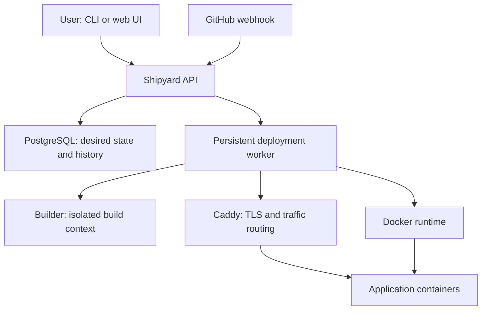
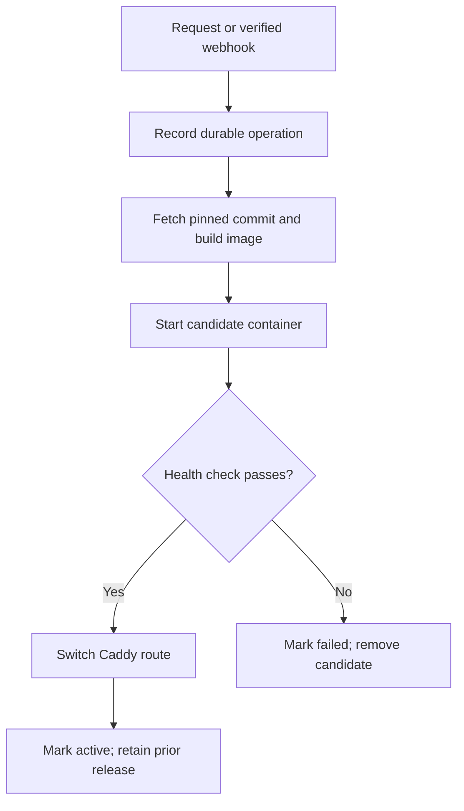

# Shipyard Architecture

> A self-hosted deployment platform for applications on a single VPS.

**Status:** Proposed architecture · **Scope:** MVP and near-term evolution

## 1. Goals

Shipyard turns a Git repository with a Dockerfile into a running application behind HTTPS. A successful deployment has a traceable source revision, an immutable image, a health result, a route, and a rollback target.

- Deploy from a GitHub repository manually or through a verified webhook.
- Build a Docker image, start an isolated container, and publish it on a domain.
- Manage application configuration, deployments, logs, health, and rollback.
- Keep operations understandable on one Linux host before introducing distributed orchestration.

### Non-goals for the MVP

Multi-node scheduling, Kubernetes, arbitrary buildpack detection, managed databases, horizontal autoscaling, and a general CI service. The first release accepts repositories that contain a Dockerfile.

## 2. System boundary



Shipyard runs on a single host. The API authenticates requests and records intent. A worker serializes operations per application, builds and starts a release, checks health, then updates Caddy's route. PostgreSQL stores application configuration, release records, operation state, and audit events. Docker holds running workloads and local images; Docker state alone is never the source of truth.

**Initial deployment:** Run API and worker as separate processes from one Go codebase. Use PostgreSQL for durable job state; avoid Redis until queue throughput requires it. Caddy terminates TLS and reverse proxies public traffic. A React UI can follow the CLI and API; it should not be a prerequisite for a working deploy.

## 3. Components and responsibilities

| Component | Responsibility | Key boundary |
| --- | --- | --- |
| API | Authentication, authorization, validation, application and deployment endpoints | Never executes repository code in the request path |
| Webhook receiver | Verifies GitHub signature, delivery ID, repo identity, branch, and commit SHA | Rejects unverified or duplicate deliveries |
| Deployment worker | Claims durable jobs, coordinates build, launch, health, traffic switch, cleanup | One active deployment per application |
| Builder | Checks out the exact commit and builds a tagged image from its Dockerfile | Untrusted source; strict resource and time limits |
| Docker runtime | Creates isolated containers, starts/stops them, collects status and logs | Narrow internal interface; restricted Docker access |
| Route manager | Adds/removes Caddy routes and checks configuration changes | Only healthy candidate releases receive traffic |
| Secret store | Encrypts secrets at rest and supplies them to the target process | Never returns plaintext secrets in API or logs |
| Reconciler | Compares database intent with containers and routes after restart | Repairs interrupted operations idempotently |

The Docker daemon is a privileged boundary. Do not give application containers the Docker socket, host network, privileged mode, or arbitrary host mounts. Isolating the builder and limiting which repositories may be deployed are essential before offering Shipyard to multiple users.

## 4. Data model

- **User / API token:** identity, scoped permissions, token hash, expiration.
- **Application:** owner, repository, tracked branch, internal port, hostname, health path, desired release.
- **Environment revision:** encrypted secret values and non-secret configuration; deployments reference a revision.
- **Deployment:** application, source commit SHA, image digest, configuration revision, status, timestamps, failure reason.
- **Operation:** durable job kind, idempotency key, lease, retry count, phase, last error.
- **Route:** hostname, active deployment, target container and port.
- **Audit event:** actor, action, target, timestamp, result; excludes secret values.

A deployment references an immutable image digest and configuration revision. Retain the last known good release, its image, and its environment revision for rollback. Limit history and disk use through an explicit retention policy.

## 5. Deployment lifecycle



1. Resolve the exact commit SHA and create an operation with an idempotency key. A repeated webhook delivery does not create a second deployment.
2. Lock the application for one active operation. Fetch the commit, validate the Dockerfile location, and build an image tagged by application and commit. Store its digest.
3. Start a candidate on a private Docker network with resource limits and the referenced configuration revision. No host port is exposed for the application.
4. Probe its configured HTTP health path until success or timeout. The default path may be `/`, but each app can override it.
5. Update the Caddy route to the healthy candidate and verify the route change. Mark it active only after routing succeeds.
6. Keep the old container and image during a short observation window. Then stop the old container; retain the image and metadata for rollback.

A failed build or health check leaves the current route untouched. A route update failure restores the previous target and marks the operation failed. On process restart, the reconciler inspects unfinished operations, container labels, and the active route before retrying or compensating.

### Rollback

Rollback is a new operation that targets a prior successful deployment. Start a container from its retained image digest and original environment revision, confirm health, switch the route, and record the new active state. If the retained artifact is gone, report that rollback is unavailable instead of silently rebuilding a moving Git branch.

## 6. API and CLI shape

| CLI example | API operation |
| --- | --- |
| `shipyard app create --repo owner/repo --branch main --port 3000` | `POST /v1/apps` |
| `shipyard deploy APP --ref <commit-sha>` | `POST /v1/apps/{id}/deployments` |
| `shipyard ps` | `GET /v1/apps` |
| `shipyard logs APP --follow` | `GET /v1/apps/{id}/logs` with SSE |
| `shipyard rollback APP --to <deployment-id>` | `POST /v1/apps/{id}/rollbacks` |
| `shipyard env set APP KEY` | `PUT /v1/apps/{id}/secrets/{key}` |
| `shipyard domain set APP example.com` | `PUT /v1/apps/{id}/domain` |

Use SSE for one-way live logs and operation events; introduce WebSockets only when bidirectional interaction is needed. Paginate historical logs or offer bounded tails, and redact known secret values. Avoid assuming redaction catches every secret an app may print.

## 7. Security and operational defaults

- **Access:** require authentication for API and CLI; use scoped tokens, TLS, and audit logs. Bind admin endpoints to a trusted interface or place them behind access controls.
- **GitHub:** verify `X-Hub-Signature-256` against the raw request body; validate delivery identity and repository mapping. Prefer a GitHub App with narrow repository access when private repositories are supported.
- **Builds:** treat Dockerfiles as untrusted code. Bound CPU, memory, disk, network access, output size, and duration; avoid injecting Shipyard control-plane secrets into builds.
- **Containers:** run without privileged mode, disable dangerous capabilities, apply resource and log limits, and use dedicated networks. Docker access belongs only to the trusted worker.
- **Secrets:** use authenticated encryption with a separately protected master key; never place the master key in PostgreSQL. Document backup and key recovery procedures.
- **Domains:** prove hostname control or restrict allowed domains before issuing certificates. Make route updates reversible.
- **Reliability:** persist operation phases, use leases with expiry, handle duplicate events, back up PostgreSQL and the encryption key, and monitor disk space.
- **Observability:** structured logs with request, operation, app, and deployment IDs; basic metrics for deployment duration, failure rate, container health, and disk usage.

Single-host Docker isolation is insufficient for hosting arbitrary untrusted tenants as a strong security boundary. The MVP should be documented as trusted-user or trusted-repository software.

## 8. Repository layout

```text
cmd/shipyard/          CLI
cmd/shipyard-api/      HTTP server and webhook receiver
cmd/shipyard-worker/   deployment worker and reconciler
internal/api/          handlers and authorization
internal/application/  deployment use cases and state transitions
internal/git/          source fetch and GitHub integration
internal/build/        image builds
internal/runtime/      container lifecycle
internal/routing/      Caddy integration
internal/store/        PostgreSQL persistence
internal/secrets/      encryption and configuration revisions
migrations/            database schema
web/                   optional React UI
docs/                  user and operator documentation
```

Keep interfaces narrow and defined where they are consumed. A future `Runtime` interface can support other backends once Docker behavior is proven; do not add Kubernetes abstractions before a second runtime exists.

## 9. Delivery milestones

1. **Foundation:** application CRUD, token authentication, PostgreSQL migrations, Docker runtime, and manual deployment of a public sample repository.
2. **Usable deployment:** immutable release record, health gate, Caddy domain/HTTPS routing, log streaming, and failure-safe deployment.
3. **Recovery:** deployment history, rollback, persistent jobs, restart reconciliation, cleanup, and backup instructions.
4. **GitHub integration:** signed webhook verification, duplicate handling, private repository access, branch policy, and automated deploys.
5. **Hardening and UI:** secrets, limits, audit trail, React UI, metrics, and an installation guide.

**Acceptance demo:** On a fresh VPS, install Shipyard, connect a sample repository, deploy it over HTTPS, push a working change, push a broken change and show the prior release still serving, then roll back to an earlier healthy release. Restart Shipyard midway through an operation and show it reaches a consistent state.

## 10. Open design decisions

- Should the first release support only one administrator, or several trusted users with application-level permissions?
- Which minimal Docker build path will Shipyard support initially, and how will build isolation be enforced on a shared host?
- Should a domain have exactly one active application, and how will ownership be verified?
- How many releases and how much log data can the host retain by default?
- Which backup and restore procedure will be tested before calling the system production-ready?
